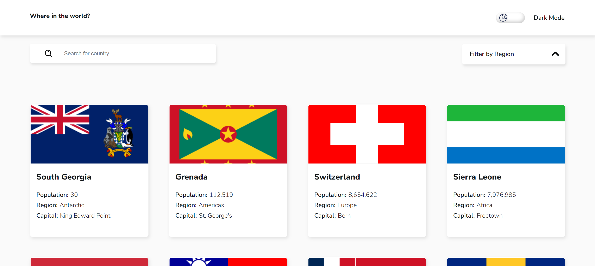
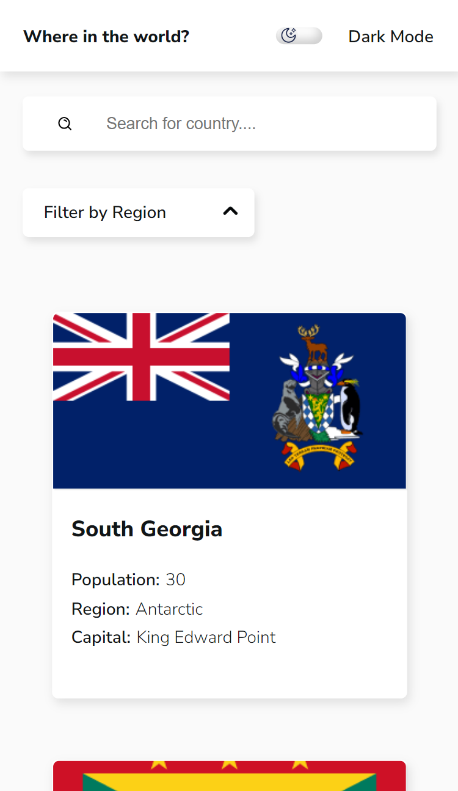

# Frontend Mentor | Rest Countries API

This repository contains my solution for the "Rest Countries API" challenge on Frontend Mentor. The project involves creating a responsive web application that allows users to explore country information from the Rest Countries API.

## Table of Contents

- [Overview](#overview)
  - [Screenshot](#screenshot)
  - [Links](#links)
- [My Process](#my-process)
  - [Built With](#built-with)
  - [What I Learned](#what-i-learned)
  - [Continued Development](#continued-development)
  - [Useful Resources](#useful-resources)
- [Author](#author)
- [Acknowledgments](#acknowledgments)

## Overview

### Screenshot

### Links

- Solution URL: [Frontend Mentor Solution](https://www.frontendmentor.io/solutions/your-solution-url)
- Live Site URL: [Live Demo](https://your-github-username.github.io/your-repo-name)

## My Process

This project focuses on building a user-friendly application that provides comprehensive information about countries, including their names, regions, and populations. The design is clean and adheres to modern web practices, ensuring a seamless experience across devices.

### Built With

- **Semantic HTML5 Markup:** Utilized semantic elements for improved accessibility and SEO.
- **CSS:** Used custom properties for consistent styling, Flexbox for layout, and responsive design techniques.
- **JavaScript:** Implemented dynamic content loading and interactivity to enhance user engagement.

### Features

- **Search Functionality:** Users can search for countries by name.
- **Region Filtering:** Filter countries by continent or region.
- **Dark/Light Mode Toggle:** Switch between light and dark themes for improved user experience.
- **Error Handling:** Displays a user-friendly message when a country is not found.

### JavaScript Functionality

The project includes a single JavaScript file that handles core functionality. Key components include:

- **Input Handling:** Listens for changes in the search field and filter options.
- **API Integration:** Fetches country data from the Rest Countries API based on user input.
- **UI Updates:** Dynamically updates the displayed country information based on the search results.

### What I Learned

Through this project, I enhanced my skills in:

- **API Integration:** Effectively using the Fetch API to retrieve and display data.
- **Dynamic UI Updates:** Manipulating the DOM to reflect real-time user interactions.
- **Responsive Design:** Creating a layout that adapts to various screen sizes using CSS Flexbox.
- **Accessibility:** Ensuring that all interactive elements are accessible to all users.

### Continued Development

Future updates may include:

- **Additional Features:** Implementing detailed country profiles with more information.
- **Styling Enhancements:** Adding more advanced styling and animations to improve the user experience.
- **Error Handling:** Implementing validation and error messages for user inputs.

### Useful Resources

- [MDN Web Docs](https://developer.mozilla.org/en-US/) - Comprehensive documentation for web technologies.
- [CSS-Tricks](https://css-tricks.com/) - Articles and tutorials on modern CSS techniques.
- [JavaScript.info](https://javascript.info/) - In-depth JavaScript tutorials and guides.
- [Frontend Mentor](https://www.frontendmentor.io/) - Platform for frontend challenges and community feedback.

## Author

- **Frontend Mentor:** [@YourUsername](https://www.frontendmentor.io/profile/@YourUsername)
- **GitHub:** [@YourUsername](https://github.com/YourUsername)

## Acknowledgments

A special thanks to Frontend Mentor for providing this challenging project and to the community for their valuable feedback and support throughout the development process.
